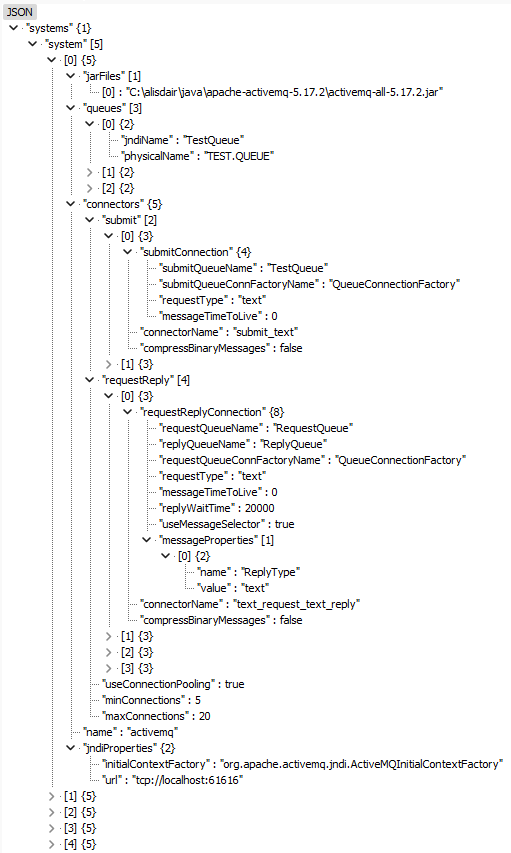

# Messaging Infrastructure Overview
The messaging infrastructure is a framework written in Java used to communicate with a JMS compliant messaging system such as ActiveMQ.

It is a maven project containing a Spring Boot application which exposes a series of REST endpoints to send and receive messages.

The messaging infrastructure supports the following messaging systems:
 - [ActiveMQ](https://activemq.apache.org/)
 - [RabbitMQ](https://www.rabbitmq.com/)
 - [Kafka](https://kafka.apache.org/)

Other messaging systems can be added using the configuration file.

The messaging infrastructure has the following features:
 - Handles both text and binary messages.
 - Compresses binary messages if required.
 - Pool and limit the number of connections to the messaging system.

This infrastructure deals with point-to-point messaging using queues. It could easily be extended to deal with publish/subscribe messaging using topics.

## Asynchronous Messaging

Asynchronous messaging is where the client application sends data to another application and does not expect a reply:

                    +-----------+                   +-----------+
                    |           |                   |           |
                    |           |                   |           |
                    |   App 1   | ====> Queue ====> |   App 2   |
                    |           |                   |           |
                    |           |                   |           |
                    +-----------+                   +-----------+

The acknowledgement of the delivery of the message is the successful putting of the message onto the queue as there is guaranteed delivery ie as far as Application 1 is concerned the message has been delivered to Application 2 if Application 1 has put the message successfully onto the queue. No direct response from Application 2 is required.

The messaging infrastructure calls this scenario "submit".

## Synchronous Messaging

Synchronous messaging is where the client application sends data to another application and receives a reply. The client puts a "request" onto one queue and waits for a "reply" on another queue:

                    +-----------+                     +-----------+
                    |           |                     |           |
                    |           | ====> Queue 1 ====> |           |
                    |   App 1   |                     |   App 2   |
                    |           | <==== Queue 2 <==== |           |
                    |           |                     |           |
                    +-----------+                     +-----------+

Application 1 puts a message onto Queue 1 (the "request" queue) and waits for the reply on Queue 2 (the "reply" queue). Meanwhile Application 2 picks up the request message, deals with it, and put the reply onto Queue 2 for Application 1 to pick up.

The messaging infrastructure calls this scenario "request-reply".

In Java, Application 2 could be a message drive bean deployed in an EJB or Spring container. This bean would implement the javax.jms.MessageListener interface to listen to the messages as they arrive on the request queue.

## Configuration

The messaging infrastructure is configured by a JSON file.

When the messaging infrastructure starts up it looks for an msginf-config.json file in the class path by default or uses the following Java property set on the command line:

`-Dmsginf.propertiesfile=/somepath/mymessagingfile.json`

This file will need to be edited to suit your environment.

When the messaging infrastructure receives its first message it starts up all the connections automatically using the information in the properties file and then sends the message.

The configuration file contains all the information required by the messaging infrastructure to start up, where to send messages, and how to deal with the messages.

The configuration file will need to be edited to suit your environment before any tests can be run.

An example of the configuration file can be found [here](src/main/resources/msginf-config.json).



The configuration file can have multiple messaging systems defined and each messaging system can have multiple connectors.

The system attribute represents the configuration of a messaging system and has the following sub-attributes:

| System Attribute | Description                                                                                                          |
|------------------|----------------------------------------------------------------------------------------------------------------------|
| name             | The name of the messaging system. This is the name used when constructing the QueueManager object as outlined below. |
| jndiProperties   | The [JNDI properties](#jndiProperties) used to connect to the messaging system.                                      |
| jarFiles         | An array of paths to external jar files required by the messaging system.                                            |
| queues           | An array of [queues](#queues) used by the messaging system.                                                          |
| connectors       | The [connectors](#connectors) used by the messaging system.                                                          |

| <a id="jndiProperties">JNDI Property Attributes</a> | Description                                                                      |
|-----------------------------------------------------|----------------------------------------------------------------------------------|
| initialContextFactory                               | The initial context factory used by the messaging system.                        |
| url                                                 | The url to connect to the messaging system.                                      |
| namingFactoryUrlPkgs                                | A comma separated list of the factory url packages used by the messaging system. |
| vendorJNDIProperties                                | An array of [vendor specific JNDI properties](#vendorJNDIProperties).                                |

| <a id="vendorJNDIProperties">Vendor JNDI Property Attributes</a> | Description                                     |
|------------------------------------------------------------------|-------------------------------------------------|
| name                                                             | The name of the vendor specific JNDI property.  |
| value                                                            | The value of the vendor specific JNDI property. |

| <a id="queues">Queue Attributes</a> | Description                                             |
|-------------------------------------|---------------------------------------------------------|
| jndiName                            | The JNDI name of the queue in the messaging system.     |
| physicalName                        | The physical name of the queue in the messaging system. |

<a id="connectors"></a>
Connectors are one of two types: submit and requestReply. Submit connectors send messages asynchronously and requestReply connectors send messages synchronously i.e. expect and wait for a reply. 

| Connector Attributes | Description                                           |
|----------------------|-------------------------------------------------------|
| useConnectionPooling | Whether to use queue connection pooling or not.       |
| minConnections       | The minimum number of queue connections in the pool.  |
| maxConnections       | The maximum number of queue connections in the pool.  |
| submit               | An array of [submit connectors](#submit).             |
| requestReply         | An array of [requestReply connectors](#requestReply). |

| <a id="submit">Submit Connector Attributes</a> | Description                                               |
|------------------------------------------------|-----------------------------------------------------------|
| submitConnection                               | The [submit connection](#submitConnection) configuration. |
| connectorName                                  | The name of the submit connector.                         |
| compressBinaryMessages                         | Whether to compress binary connections or not.            |

| <a id="submitConnection">Submit Connection Attributes</a> | Description                                          |
|-----------------------------------------------------------|------------------------------------------------------|
| submitQueueName                                           | The queue to submit the messages to.                 |
| submitQueueConnFactoryName                                | The queue connection factory.                        |
| requestType                                               | The request type: text or binary.                    |
| messageTimeToLive                                         | The time in ms for the message to live.              |
| messageProperties                                         | The [properties](#messageProperties) of the message. |

| <a id="requestReply">Request-Reply Connector Attributes</a> | Description                                                            |
|-------------------------------------------------------------|------------------------------------------------------------------------|
| requestReplyConnection                                      | The [request-reply connection](#requestReplyConnection) configuration. |
| connectorName                                               | The name of the request-reply connector.                               |
| compressBinaryMessages                                      | Whether to compress binary connections or not.                         |

| <a id="requestReplyConnection">Request-Reply Connection Attributes</a> | Description                                              |
|------------------------------------------------------------------------|----------------------------------------------------------|
| requestQueueName                                                       | The request queue to submit the messages to.             |
| replyQueueName                                                         | The reply queue to receive the reply messages from.      |
| requestQueueConnFactoryName                                            | The queue connection factory.                            |
| requestType                                                            | The request type: text or binary.                        |
| messageTimeToLive                                                      | The time in ms for the message to live.                  |
| replyWaitTime                                                          | The time in ms to wait for a reply message.              |
| useMessageSelector                                                     | Whether to use a message selector for the reply message. |
| messageProperties                                                      | The [properties](#messageProperties) of the message.     |

| <a id="messageProperties">Message Property Attributes</a> | Description                        |
|-----------------------------------------------------------|------------------------------------|
| name                                                      | The name of the message property.  |
| value                                                     | The value of the message property. |

## Spring Boot
The messaging infrastructure is a maven project containing a Spring Boot application which exposes a series of REST endpoints to send and receive messages.

See the Swagger UI at http://localhost:8080/msginf/swagger-ui/index.html

### Calling the messaging code directly

The underlying messaging code can also be called directly.

The following is an example of the messaging infrastructure calling the activemq messaging system and the text_request_text_reply connector as defined in the msginf-config.json file:

```
MessageRequest messageRequest = new MessageRequest(MessageRequestType.SUBMIT, "text_request_text_reply");
messageRequest.setTextMessage("Hello");
QueueManager qm = new QueueManager("activemq");
MessageResponse response = queueManager.sendMessage(messageRequest);
String textResponse = response.getTextResponse
```

